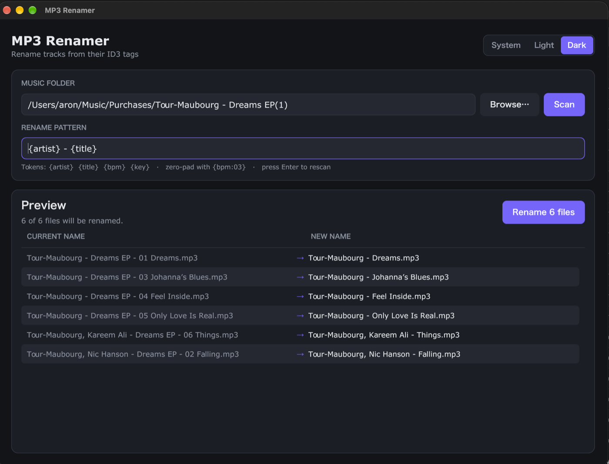

# MP3 Renamer

A small desktop app that renames MP3 files based on their ID3 tags, for example
turning `track01.mp3` into `123 04A Daft Punk - One More Time.mp3`. Built with
[Gio](https://gioui.org).



## Using it

1. **Choose a folder.** Click **Browse…** to pick a folder, or type a path and
   press **Enter** or click **Scan**.
2. **Adjust the pattern** if you like (see below). Press **Enter** in the
   pattern field to refresh the preview.
3. **Check the preview.** It lists every file whose name would change, with the
   current name next to the new one. Files that already match are left out.
4. **Click "Rename N files"** to apply the changes.

The app remembers the last folder, the pattern and the theme between runs.

### Pattern tokens

| Token      | ID3 frame | Notes                                   |
|------------|-----------|-----------------------------------------|
| `{artist}` | TPE1      | Converted to Title Case                 |
| `{title}`  | TIT2      | Converted to Title Case                 |
| `{bpm}`    | TBPM      |                                         |
| `{key}`    | TKEY      |                                         |

Add `:N` to zero-pad a value to at least N characters. For example, `{bpm:03}`
turns `95` into `095`. The default pattern is:

```
{bpm:03} {key:03} {artist} - {title}
```

`.mp3` is added automatically.

### Theme

Use the **System / Light / Dark** switch in the top-right corner. **System**
follows the operating system's appearance and picks up changes within a few
seconds.

### Settings file

Settings are stored as JSON in:

| OS      | Path                                                      |
|---------|-----------------------------------------------------------|
| macOS   | `~/Library/Application Support/mp3renamer/config.json`    |
| Windows | `%AppData%\mp3renamer\config.json`                        |
| Linux   | `~/.config/mp3renamer/config.json`                        |

Delete the file to reset to the defaults.

## Building

Requires **Go 1.24+**. Run `make help` to list all targets.

```sh
make run      # run from source
make build    # binary for the current platform, in dist/
```

### macOS

```sh
make macos         # universal app (Apple Silicon + Intel): dist/macos/MP3 Renamer.app
make macos-arm64   # Apple Silicon only
make macos-amd64   # Intel only
```

Needs the Xcode Command Line Tools (`xcode-select --install`). The app is
signed ad hoc, which is fine on your own Mac. On another Mac, Gatekeeper will
block the first launch: right-click the app and choose **Open**. Distributing
it more widely requires a Developer ID signature and notarization.

### Windows

```sh
make windows       # dist/windows/mp3renamer-amd64.exe and -arm64.exe
```

This cross-compiles from macOS or Linux; no Windows machine is needed. The
`.exe` includes the app icon. Set the file version with
`make windows VERSION=1.2.0.1`.

### Linux

Gio uses cgo on Linux, so build on a Linux machine. On Debian/Ubuntu, install
the dependencies first:

```sh
sudo apt install gcc pkg-config libwayland-dev libx11-dev libx11-xcb-dev \
  libxkbcommon-x11-dev libgles2-mesa-dev libegl1-mesa-dev libffi-dev \
  libxcursor-dev libvulkan-dev
make linux         # dist/linux/mp3renamer
```

The folder picker needs `zenity` (GNOME) or `kdialog` (KDE) to be installed.
System theme detection uses GNOME's `gsettings`.

### App icon

`icon.png` is generated by `tools/genicon`. After changing the colours or shape
there, regenerate it with:

```sh
make icon
```

## Project layout

| File                 | Purpose                                              |
|----------------------|------------------------------------------------------|
| `main.go`            | App state, scanning/renaming, and the UI layout      |
| `theme.go`           | Light/dark palettes and OS appearance detection      |
| `config.go`          | Loading and saving settings                          |
| `utils.go`           | Drawing and layout helpers                           |
| `icon.go`            | Embeds `icon.png` into the binary                    |
| `dockicon_darwin.go` | Sets the Dock icon when running outside an `.app`    |
| `tools/genicon/`     | Generates `icon.png`                                 |
